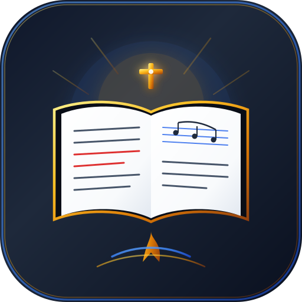

# Have On Behalf (H.O.B)

<p align="center">
  
</p>

<p align="center">
  <strong>An offline-first worship companion, scripture study suite, and sanctuary projection platform for Seventh-day Adventist congregations and believers worldwide.</strong>
</p>

<p align="center">
  <a href="https://ais-pre-2cggwqidagaiymobrj5on3-744712673503.europe-west2.run.app" target="_blank">
    
  </a>
  
  
  
  
  
</p>

---

## 📖 About The Project

**Have On Behalf** is engineered specifically for Sabbath divine worship, song service leadership, personal devotional study, and church sanctuary projection.

Unlike generic presentation tools that require costly monthly subscriptions or cloud connectivity that drops on Sabbath mornings, Have On Behalf is **100% offline-first**, storing all hymnals, scripture versions, and Spirit of Prophecy writings directly in the browser's local cache.

### 🏷️ Repository Tags & Topics
`seventh-day-adventist` • `sda-hymnal` • `worship-software` • `pwa` • `offline-first` • `react` • `typescript` • `adventist-hymns` • `church-projection` • `nyimbo-za-kristo` • `sanctuary` • `vespers` • `spirit-of-prophecy`

---

## 🌟 Key Features

### 1. 🎵 Multi-Lingual Adventist Hymnology
- **Complete Datasets**: Full collections for **SDAH** (1–695), **Nyimbo Za Kristo** (220 Swahili hymns), and **Nyĩmbo Cia Agendi** (299 Gĩkũyũ hymns).
- **Pitch Transposition Engine**: Built-in Web Audio tone synthesizer to sound initial starting pitches with real-time semitone transposition (-3 to +3 semitones).
- **Cross-Language Mapping**: Instant cross-reference links between English, Swahili, and Gĩkũyũ hymns (e.g. SDAH 159 ↔ NZK 46 ↔ NCA 52).

### 2. 📽️ AdventistHymns-Style Sanctuary Beam Projector
- **16:9 Presentation Mode**: Minimalist, high-legibility sanctuary projection designed for church projectors and LED walls.
- **Intelligent Slide Chunking**: Stanzas automatically split into readable 2–4 line projection slides (e.g., Verse 2a, Verse 2b) without text crowding.
- **Subtle Progress Indicators**: Thin, distraction-free progress bars at the bottom of the screen with numbers and percentages hidden.
- **Multi-Theme Sanctuary Backdrops**: Sanctuary Sapphire, Cathedral Light, Holy Gold, and Obsidian Dark.

### 3. 📜 Holy Scriptures & Red-Letter Words of Christ
- **Multiple Versions**: King James Version (KJV), New King James Version (NKJV), and Swahili Union Version (SUV).
- **Words of Christ in Red**: Toggleable red-letter formatting for the spoken words of Jesus Christ.
- **Multi-Verse Beaming**: Checkbox selection for projecting custom scripture passages.

### 4. 🕊️ Ellen G. White Writings (Spirit of Prophecy)
- Foundational writings including *Steps to Christ*, *The Desire of Ages*, *The Great Controversy*, and *Patriarchs and Prophets*.
- Paragraph-level referencing and instant beaming for sermons and Sabbath School discussions.

### 5. 🎛️ Minimalist Reading Mode & Dynamic Typography
- Full-screen distraction-free reader with real-time sliders for font size (`14px`–`32px`) and line spacing (`1.30x`–`2.40x`).

### 6. 📅 Worship Session Planner (Vespers & Divine Service)
- Build customized service programs (opening song, scripture reading, sermon reference, closing hymn) and launch them as a continuous projection session.

---

## 🗺️ Cross-Platform Roadmap

| Phase | Target | Highlights | Status |
| :--- | :--- | :--- | :--- |
| **Phase 1** | **Web PWA Hardening** | Clean liturgical themes (Sanctuary Sapphire), 1-click dataset exporter, responsive scripture selectors | **Active** |
| **Phase 2** | **Mobile-First Hymnal (Flutter)** | Dedicated tab stack with quick back buttons, inline cross-language stanzas, thumb-zone controls | **Planned** |
| **Phase 3** | **Desktop Wrapper (Tauri)** | Native `.exe` / `.dmg` installer with multi-display projector routing and local server | **Planned** |
| **Phase 4** | **Sanctuary Cast & Remote** | 6-character room pairing allowing phones to remotely steer projector slides | **Planned** |

*See [GROOMING.md](GROOMING.md) for sprint epics and user stories, and [docs/ROADMAP_AND_PHASES.md](docs/ROADMAP_AND_PHASES.md) for the phased architectural breakdown.*

---

## 📦 Clean Datasets & Export Format

All extracted hymnal datasets are stored in canonical JSON format in `public/data/` and can be exported with a single click from the **Settings** menu for use in mobile apps:
- `public/data/sdah.json`
- `public/data/nzk.json`
- `public/data/nca.json`

*See [docs/DATA_SCHEMAS_AND_EXPORT.md](docs/DATA_SCHEMAS_AND_EXPORT.md) for JSON schemas and Flutter Dart models.*

---

## 💻 Local Development Setup

```bash
# 1. Clone the repository
git clone https://github.com/your-username/have-on-behalf.git
cd have-on-behalf

# 2. Install dependencies
npm install

# 3. Launch development server (Runs on port 3000)
npm run dev

# 4. Check types and build production bundle
npm run lint
npm run build
```

---

## 🤝 Contributing

Contributions are welcomed with joy! Please review [CONTRIBUTING.md](CONTRIBUTING.md) for our pull request workflow and hymnal verification standards.

---

## 📄 License

This project is open source and licensed under the [MIT License](LICENSE).
All hymns and scriptures used are from open, non-commercial public domain collections.
